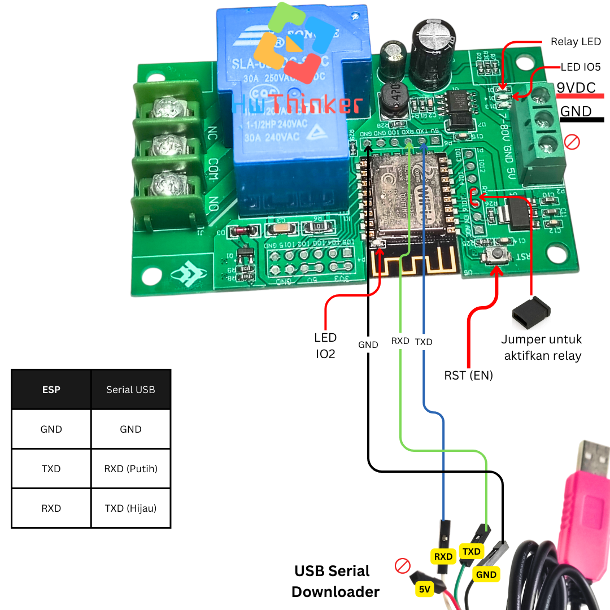
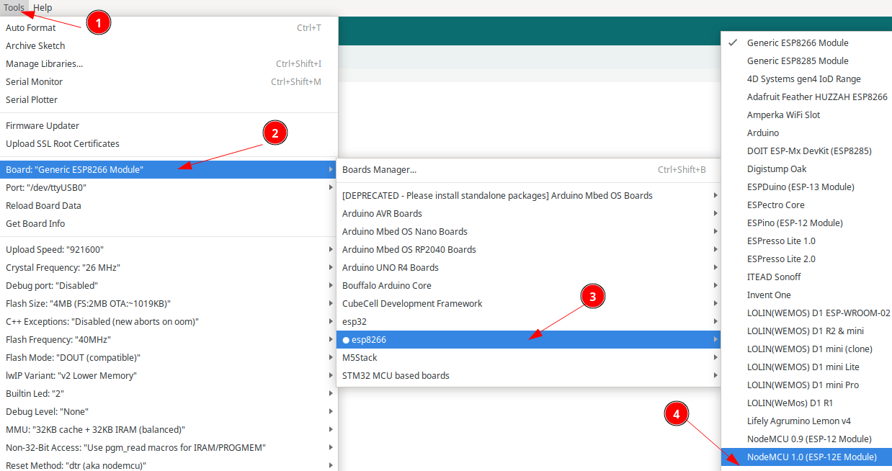
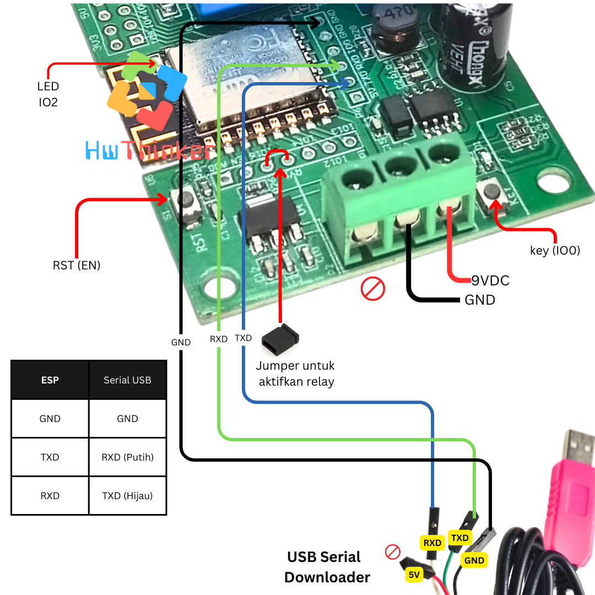
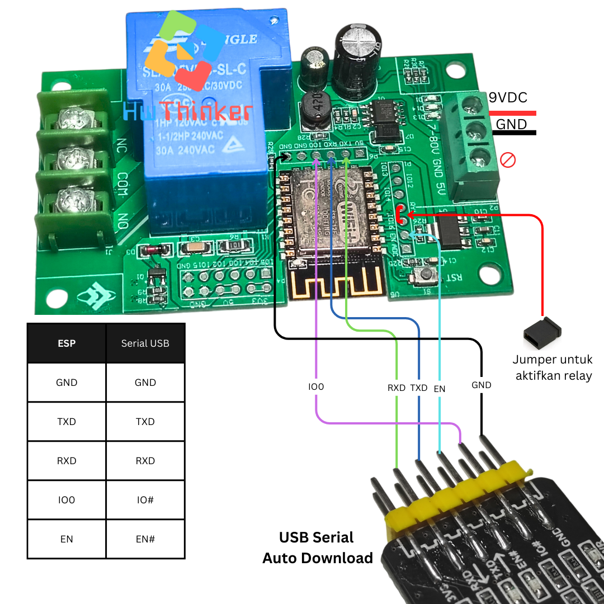

# ESP8266 Relay 1 Channel 30A


Modul ESP8266 ini  mengontrol relay 1-channel 30A dengan konfigurasi GPIO sebagai berikut:
- Relay: GPIO 16 
- LED ESP: GPIO 2 
- LED Board: GPIO 5 

## Deskripsi
Dalam proyek ini, relay dihubungkan ke pin GPIO 16 dari ESP8266. Harap diperhatikan bahwa relay tidak terhubung secara default ke GPIO 16, sehingga diperlukan jumper untuk menghubungkan relay dengan pin tersebut. Setelah dihubungkan, relay dapat dikontrol secara digital untuk mengaktifkan atau mematikan perangkat yang terhubung dengan kemampuan menangani arus hingga 30A.

LED ESP pada GPIO 2 dan LED pada board di GPIO 5 juga digunakan untuk memberikan indikasi status saat relay aktif..


## Cara install plugin Arduino IDE

### Langkah 1: Buka Arduino IDE

1. Buka aplikasi Arduino IDE di komputer Anda. Jika belum ada, unduh dan instal Arduino IDE dari situs resmi Arduino di https://www.arduino.cc/en/software. disarankan menggunakan arduino ide versi 2

### Langkah 2: Tambahkan URL Board Manager untuk ESP8266

2. Di Arduino IDE, buka **File** > **Preferences**.

   

3. Pada bagian  Additional Boards Manager URLs, tambahkan URL berikut:

```
https://arduino.esp8266.com/stable/package_esp8266com_index.json
```

4. Jika sebelumnya Anda sudah memiliki URL lain di sana, pisahkan URL ini dengan tanda koma atau baris baru.


### Langkah 3: Buka Boards Manager

1. Buka **Tools** > **Board** > **Boards Manager**.


2. Di kotak pencarian, ketik **ESP8266**

### Langkah 4: Instal Board ESP8266

1. Temukan **ESP8266 by Espressif Systems** di daftar, kemudian klik **Install**.


2. Tunggu hingga proses instalasi selesai.

### Langkah 5: Pilih Board ESP8266

1. Setelah instalasi selesai, Anda dapat memilih board ESP8266.
2. Buka **Tools** > **Board**, dan gulir ke bawah untuk menemukan berbagai jenis board ESP8266 yang telah diinstal. Pilih board yang sesuai, misalnya **Nodemcu 1.0 (ESP-12E Module)** 



3. hasilnya kurang lebih seperti ini


### Langkah 6: Pilih Port

1. Sambungkan board esp8266 ke komputer Anda menggunakan kabel USB.
2. Di **Tools** > **Port**, pilih port yang sesuai dengan esp8266 Anda.

## Kode Program

```c++
#include <Arduino.h>

#define relay 16
#define LEDESP 2
#define  LEDBoard 5
// Daftar GPIO output yang dapat digunakan pada ESP8266
int gpio_pins[] = {LEDESP, LEDBoard, relay}; 
int total_pins = sizeof(gpio_pins) / sizeof(gpio_pins[0]);

void setup() {
  // Inisialisasi semua pin sebagai output
  for (int i = 0; i < total_pins; i++) {
    pinMode(gpio_pins[i], OUTPUT);
  }
}

void loop() {
  // Nyalakan semua GPIO secara serempak
  for (int i = 0; i < total_pins; i++) {
    digitalWrite(gpio_pins[i], HIGH);
  }
  delay(1000); // Tunggu 1 detik

  // Matikan semua GPIO secara serempak
  for (int i = 0; i < total_pins; i++) {
    digitalWrite(gpio_pins[i], LOW);
  }
  delay(1000); // Tunggu 1 detik
}

```


## Cara download dengan serial usb biasa


- Pasang serial USB TTL dengan ketentuan: 
   - TX -> RX USB Serial (Kabel Putih)
   - RX -> TX USB Serial (Kabel Hijau)
   - GND -> GND USB Serial (Kabel Hitam)
- Pastikan supply 9VDC dihubungkan pin VCC; GND Power supply -> GND
- Tekan dan tahan tombol key pada Board
- Klik (tekan dan lepas) tombol rst(EN) pada board dan pastikan  tombol key(IO0) masih di tekan
- Lepas tombol Key
- Download program dan tunggu sampai selesai
- Klik tombol rest untuk run-program (langkah ini penting agar firmware baru dijalankan)
- ulang langkah awal bila melakukan download ulang lagi


## Cara download dengan Serial USB auto Download


- Pasang serial USB TTL dengan ketentuan:
    - RX Board  -> RX USB Serial  
    - TX Board  -> TX USB Serial 
    - GND Board -> GND USB Serial  
    - IO0 Board -> IO# USB Serial 
    - EN Board  -> EN# USB Serial
- Pastikan supply 9VDC dihubungkan pin VCC; GND Power supply -> GND
- Download program dan tunggu sampai selesai

> [!WARNING]
>Anda dapat memilih untuk menggunakan power supply dari salah satu konektor berikut: >konektor Power 9V atau konektor Power 5V. Namun, Anda tidak bisa menggunakan kedua >konektor secara bersamaan."


> [!NOTE]
> Untuk serial disarankan menggunakan modul USB-TTL yang mendukung "auto download" — otomatis mengatur EN/IO0 saat upload sehingga tidak perlu pasang-lepas jumper manual tiap kali upload.